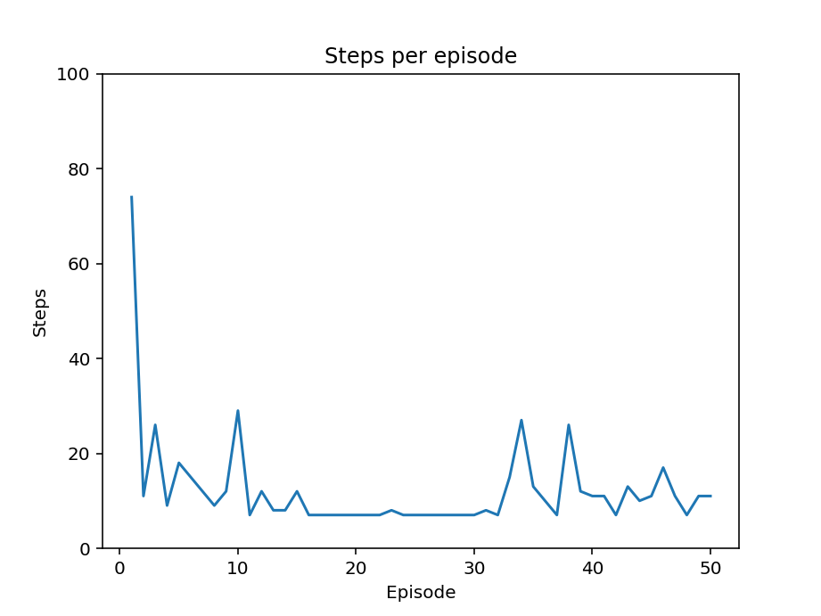
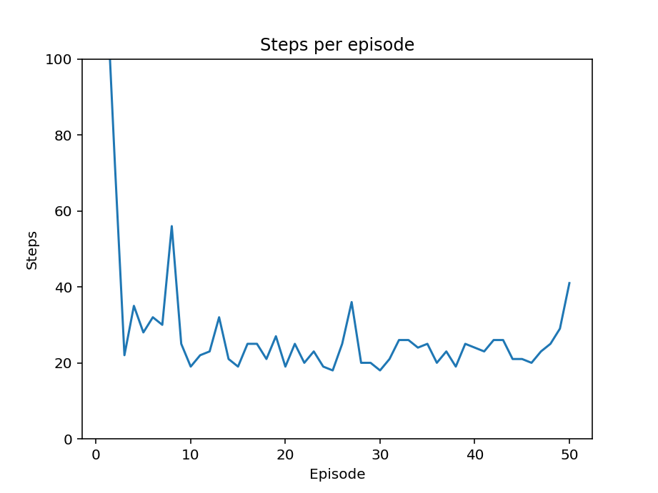
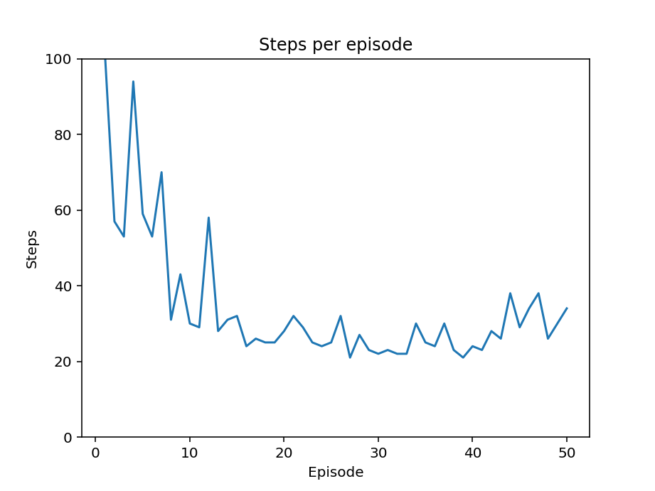

# Reinforcement Learning - Assignment 1
A `Snakes and Ladders` game for Reinforcement Learning algorithms.

| experiments \ spots                                                    | 100                       | 200                        | 300                       |
| ---------------------------------------------------------------------- | ------------------------- | -------------------------- | ------------------------- |
| **Snake-and-Ladders-v0**                                               |  |  |  |
| **Snake-and-Ladders-v1** 2 dice [1,1,3,3,5,5] and [2,2,4,4,6,6]  |                           |                            |                           |
| **Snake-and-Ladders-v1** 2 random dice                              |                           |                            |                           |
| **Snake-and-Ladders-v1** 4 random dice                              |                           |                            |                           |
| **Snake-and-Ladders-v1** 6 random dice                              |                           |                            |                           |
| **Snake-and-Ladders-v2** 6 random dice, skip ladders, and drones |                           |                            |                           |

